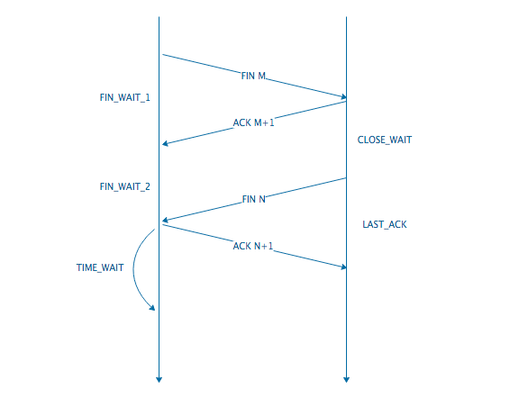
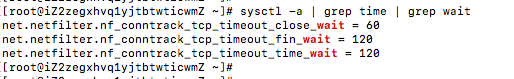

## TCP 的一些问题与解答

#### TCP 连接的初始化序列号能否固定

如果初始化序列号（缩写为ISN：Inital Sequence Number）可以固定，我们来看看会出现什么问题：

- 假设ISN固定是1，Client和Server建立好一条TCP连接后，Client连续给Server发了10个包，这10个包不知怎么被链路上的路由器缓存了(路由器会毫无先兆地缓存或者丢弃任何的数据包)，这个时候碰巧Client挂掉了；
- 然后Client用同样的端口号重新连上Server，Client又连续给Server发了几个包，假设这个时候Client的序列号变成了5；
- 接着，之前被路由器缓存的10个数据包全部被路由到Server端了，Server给Client回复确认号10，这个时候，Client整个都不好了，这是什么情况？我的序列号才到5，你怎么给我的确认号是10了，整个都乱了。

RFC793](https://tools.ietf.org/html/rfc793)中，建议ISN和一个假的时钟绑在一起，这个时钟会在每4微秒对 ISN 做加一操作，直到超过2^32，又从0开始，这需要4小时才会产生 ISN 的回绕问题，这几乎可以保证每个新连接的ISN不会和旧的连接的 ISN 产生冲突。这种递增方式的 ISN，很容易让攻击者猜测到TCP连接的ISN，现在的实现大多是在一个基准值的基础上进行随机的。

#### 初始化连接的 SYN 超时问题

Client发送SYN包给Server后挂了，Server 回给 Client 的 SYN-ACK 一直没收到 Client 的 ACK 确认，这个时候这个连接既没建立起来，也不能算失败。这就需要一个超时时间让 Server 将这个连接断开，否则这个连接就会一直占用Server的SYN连接队列中的一个位置，大量这样的连接就会将Server的 SYN 连接队列耗尽，让正常的连接无法得到处理。

目前，Linux下默认会进行5次重发SYN-ACK包，重试的间隔时间从1s开始，下次的重试间隔时间是前一次的双倍，5次的重试时间间隔为1s, 2s, 4s, 8s, 16s，总共31s，第5次发出后还要等32s都知道第5次也超时了.所以，总共需要 63s，TCP才会把断开这个连接。

由于，SYN 超时需要63秒，那么就给攻击者一个攻击服务器的机会，攻击者在短时间内发送大量的SYN包给Server(俗称 SYN flood 攻击)，用于耗尽Server的SYN队列。对于应对SYN 过多的问题，linux提供了几个TCP参数：tcp_syncookies、tcp_synack_retries、tcp_max_syn_backlog、tcp_abort_on_overflow 来调整应对。

#### TIME_WAIT 状态

`TIME_WAIT `状态是TCP连接中**主动关闭**连接的一方会进入的状态，在发出最后一个 ACK 包之后，主动关闭方进入 `TIME_WAIT` 状态，从而确保 ACK 包到达对端，以及等待网络中之前迷路的数据包完全消失，防止端口被复用的时候收到迷路包从而出现收包错误。

`TIME_WAIT` 状态会持续 2MSL（max segment lifetime）的时间，一般 1 分钟到 4 分钟。在这段时间内端口不能被重新分配使用。

Linux 上使用 `sysctl -a | grep time | grep wait ` 命令查看如下：

##### TIME_WAIT会带来哪些问题呢？

-  作为服务器，短时间内关闭了大量的 Client 连接，就会造成服务器上出现大量的TIME_WAIT连接，占据大量的tuple，严重消耗着服务器的资源；
-  作为客户端，短时间内大量的短连接，会大量消耗的Client机器的端口，毕竟端口只有65535个，端口被耗尽了，后续就无法在发起新的连接了。

##### 如何解决

服务端为了解决这个 TIME_WAIT 问题，可选的方式有3种：

* 保证由客户端主动发起关闭
* 关闭的时候使用 RST 方式（set SO_LINGER）
* 对处于 TIME_WAIT 状态的 TPC 允许重用（set SO_REUSEADDR），设置TCP参数 net.ipv4.tcp_tw_reuse = 1 和 net.ipv4.tcp_tw_recycle = 1。注意：使用tcp_tw_reuse和tcp_tw_recycle解决TIME_WAIT过多问题是非常危险的，参考[RFC](https://www.kernel.org/doc/Documentation/networking/ip-sysctl.txt)

