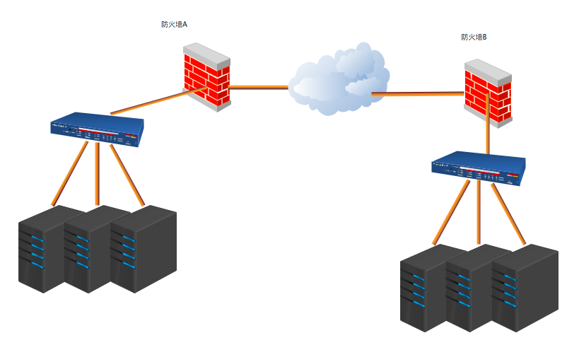

## TCP 保活机制

> TCP 协议没有轮询机制，对于一个没有传输数据的连接来说，连接也可以一直保持。理论上，中间路由器可以崩溃和重启，数据线也可以断开再重连，只要两端没有重启或更改 IP ，依然可以保持连接状态。

有的情况下，服务端需要知道客户端是否已经离开以便回收空间；有的情况下，连接很久不需要数据交换，但是我们希望保持一定的数据流。于是设计了**保活机制**。

保活机制是一种在不影响数据流内容的情况下探测对方的方式。有一个**保活计时器**实现，定时器超时，就发送一个**保活探测包**，另一端收到后会返回相应的 ACK。

保活功能默认情况下是关闭的。如果在一段时间（保活时间，keepalive time）连接处于非活动状态，开启了保活功能的一端向另一端发送一个探测报文，如果在一定时间（保活时间间隔，keepalive interval）没有收到响应，那么将继续每隔保活时间间隔发送一个探测报文，直到次数达到一个阈值（保活探测数，keepalive probe）,如果仍然没有响应，就认为对方不可达，连接中断。

在不同的系统中，这些变量默认值如下：

| times\os           | Linux | FreeBSD | OSX  | Windows |
| :----------------- | ----- | ------- | ---- | ------- |
| keepalive time     | 2h    | 2h      | 2h   | 2h      |
| keepalive interval | 75s   | 75s     | 75s  | 1s      |
| Keepalive probe    | 9     | 8       | 9    | 10      |

在 Linux 系统里，可以用以下命令查看和修改：

```she
cd /proc/sys/net/ipv4/
sysctl -a | grep keepalive // 查看
sysctl net.ipv4.tcp_keepalive_time=3600 // 修改
```

保活报文段可以为空报文段，但通常包含一个字节的数据，它的序列号为对方发送的 ACK 的最大序号减 1（为了不影响已到达的报文段）。即使探测报文丢失也不会重传。

#### 对方的四种状态

* 对方主机正常工作，并且可以到达。对方 TCP 响应正常。
* 对方主机已崩溃，包括已经关机或正在重启。对方不会响应探测报文，请求端持续发送 Keepalive probe 次的报文，然后关闭连接
* 对方主机崩溃并且已经重启。此时对方收到保活探测报文，会返回一个重置报文段，于是请求方关闭连接
* 对方主机正常工作，但是网络不可达。

一般来说主机无法分辨第二种和第四种情况，这也是一种缺陷，比如当中间路由器崩溃时，连接一方发送保活探测，于是只好断开连接。除了第一种情况，请求端的应用层会收到来自 TCP 层的差错报告，比如连接超时、连接重置等等。

### FAQ

##### 为什么两端主机和中间路由器工作正常，并且链路可达，但是没有超过 2 小时，连接也会关闭呢？



如图，两个主机之间 TCP 连接的保持同样会受到中间节点的影响，尤其是会受到防火墙（软件或硬件防火墙）的限制。防火墙的工作特性决定了要维护一个网络连接就需要耗费较多的资源，并且企业防火墙常常位于企业网络的出入口，长时间维护非活跃的 TCP 连接必将导致网络性能的下降。因此，大部分防火墙默认会关闭长时间处于非活跃状态的连接而导致 TCP 连接断连。

解决方案：

* 延长防火墙终止非活跃的 TCP 连接的时间。例如，针对上述案例，可以调节防火墙设置，将时间设置为大于服务器端设定的 2 小时。
* 缩短服务器端的 TCP 连接保活时间。缩短该时间的目的是为了在连接被防火墙终止之前发送保活探测报文，既可以探测客户端状态，又可以使连接变为活跃状态。

##### 为什么说基于 TCP 的移动端 IM 仍然需要心跳保活？

Keep Alive 机制开启后，TCP 层将在定时时间到后发送相应的 KeepAlive 探针以确定连接可用性。一般时间为 7200 s（2h），失败后重试 10 次，每次超时时间 75 s。显然默认值无法满足我们的需求，而修改过设置后就可以满足了吗？答案仍旧是否定的。

考虑一种情况，某台服务器因为某些原因导致负载超高，CPU 100%，无法响应任何业务请求，但是使用 TCP 探针则仍旧能够确定连接状态，这就是典型的*连接活着但业务提供方已死的状态*，对客户端而言，这时的最好选择就是断线后重新连接其他服务器，而不是一直认为当前服务器是可用状态，一直向当前服务器发送些必然会失败的请求。

KeepAlive 并不适用于检测双方存活的场景，这种场景还得依赖于应用层的心跳。应用层心跳有着更大的灵活性，可以控制检测时机，间隔和处理流程，甚至可以在心跳包上附带额外信息。从这个角度而言，应用层的心跳的确是最佳实践。

##### ssh 断连解决

> 通过配置 ServerAliveInterval 来实现

```shell
	Host *
    	ServerAliveInterval 30
```

Host * 意思是对所有主机生效。

ServerAliveInterval 30 #表示 ssh 客户端每隔 30 秒给远程主机发送一个 no-op 包，no-op 是无任何操作的意思，这样远程主机就不会关闭这个 SSH 会话。

如果只需对单次连接生效，加上 -o 参数即可：

```shell
ssh -o ServerAliveInterval=30 user@host
```

